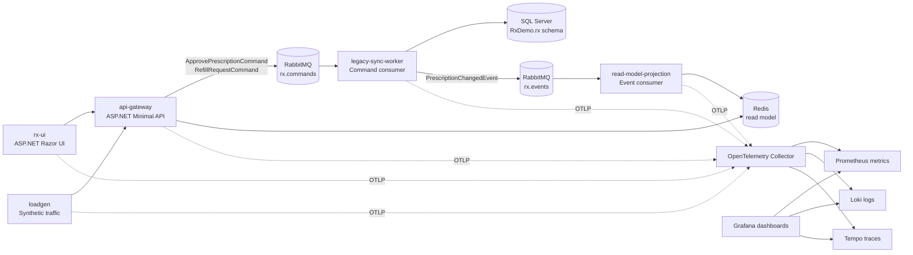

# rx-demo

`rx-demo` is a depersonalized ASP.NET medical workflow demo. It models a prescription approval and refill flow without real patient data, payer data, customer identifiers, or production credentials.

The project is intended to be easy to run in Docker Compose, portable to k3s, and useful for demonstrating logs, metrics, traces, message flow, retries, projections, and executive health scoring.

## Architecture



## Services

- `api-gateway`: ASP.NET Minimal API for prescription lookup, approval, refill, health, and demo fault modes.
- `legacy-sync-worker`: Direct RabbitMQ command consumer that writes the SQL Server transactional model and publishes domain events.
- `read-model-projection`: Direct RabbitMQ event consumer that updates the Redis read model.
- `rx-ui`: ASP.NET Razor UI for simple operator-style interactions.
- `loadgen`: Synthetic traffic generator with structured JSON logs and OpenTelemetry spans/metrics.
- `otel-collector`: Receives OTLP logs, metrics, and traces from the demo services.

## Data Model

The SQL database is `RxDemo`. The schema is `rx`.

Tables:

- `rx.Pharmacy`
- `rx.Prescription`
- `rx.PrescriptionEvent`

Stored procedures:

- `rx.UpsertPrescriptionApprove`
- `rx.UpsertPrescriptionRefill`

All identifiers are synthetic. The demo uses generated `RX-...` values and does not contain real personal or medical records.

## Local Run

The repo includes both `rx-demo.sln` and `rx-demo.slnx`. Use the classic
solution for broad IDE compatibility, or the `.slnx` file with newer .NET
tooling.

Create a local `.env` file from the sample and fill in local-only credentials:

```bash
cp .env.sample .env
```

Required values:

```text
RABBITMQ_DEFAULT_USER=<local-user>
RABBITMQ_DEFAULT_PASS=<local-password>
SA_PASSWORD=<local-sql-password>
```

Start the app stack:

```bash
docker compose up -d rabbitmq redis mssql otel-collector api-gateway legacy-sync-worker read-model-projection rx-ui
curl -fsS http://localhost:8080/healthz
curl -fsS http://localhost:8081/healthz
```

Useful endpoints:

- API: `http://localhost:8080`
- UI: `http://localhost:8081`
- RabbitMQ: `http://localhost:15672`
- OTLP HTTP: `http://localhost:4318`
- Collector metrics: `http://localhost:9464/metrics`

## Load Generation

The synthetic load generator reuses a bounded pool of prescription IDs by
default, so repeated demo runs update existing records instead of creating an
unbounded list:

```bash
LOADGEN_RX_ID_POOL_SIZE=500 \
LOADGEN_FAULT_PROFILE=light \
docker compose --profile load up -d loadgen
```

Useful controls:

- `LOADGEN_RX_ID_POOL_SIZE`: number of synthetic IDs to reuse. Set `0` for an unbounded sequential stream.
- `LOADGEN_FAULT_PROFILE`: `off`, `light`, `moderate`, or `aggressive`. The built-in rates are 0%, 4%, 10%, and 25%.
- `LOADGEN_FAULT_RATE`: explicit override for the selected profile.
- `LOADGEN_FAULT_MODES`: comma-separated allowed fault modes.
- `LOADGEN_CLIENT_TIMEOUT_SECONDS`: client timeout; keep it above `api-slow` delay when slow calls should complete.
- `READ_MODEL_MAX_ITEMS`: max Redis read-model rows retained for list views.

The default light fault set is
`api-slow,api-error,worker-transient-once,worker-fail,projection-timeout,projection-fail,cache-fail`.
Fault selection is weighted toward slow calls and transient worker retries so
dashboards show realistic degradation before hard failures dominate the run.

## Local Observability

Run Grafana, Prometheus, Loki, Tempo, and Promtail locally:

```bash
LOKI_ENDPOINT=http://loki:3100/loki/api/v1/push \
TEMPO_ENDPOINT=http://tempo:4318 \
docker compose --profile local-observability up -d
```

Grafana is available at `http://localhost:3000`.

Provisioned dashboards:

- `Rx Overview`
- `Rx Service Flow`
- `Rx Executive Health`
- `Rx Executive Flow`
- `Rx Grafmaid Probe`
- `Rx Traffic Map`
- `Rx Tempo Traces`

The executive dashboard uses component health gauges emitted by the services:

- `rx_component_health_percent`
- `rx_component_weight_percent`
- `rx_component_health_status`
- `rx_component_error_events_5m`

Weighted health is calculated with:

```promql
sum(max by(component) (rx_component_health_percent) * on(component) max by(component) (rx_component_weight_percent))
/
sum(max by(component) (rx_component_weight_percent))
```

The Tempo traces dashboard uses TraceQL metrics for dashboard panels and links
to Tempo Explore for raw trace waterfall inspection. Useful queries for this
demo include:

```traceql
{ resource.service.namespace = "rx" }
{ resource.service.namespace = "rx" && status = error }
{ resource.service.namespace = "rx" } | rate() by (resource.service.name)
{ resource.service.namespace = "rx" } | quantile_over_time(span:duration, .95) by (resource.service.name)
```

TraceQL metric panels require Tempo's `local-blocks` metrics-generator
processor. The bundled `collector/tempo.yml` enables it with separate
generator WAL paths for metrics and trace-local blocks.

## Kubernetes

The active manifests live under `k8s/`.

Create the runtime secret outside the repo:

```bash
kubectl create namespace rx-demo
kubectl -n rx-demo create secret generic rx-demo-secrets \
  --from-literal=SA_PASSWORD='<local-sql-password>' \
  --from-literal=RABBITMQ_DEFAULT_USER='<local-user>' \
  --from-literal=RABBITMQ_DEFAULT_PASS='<local-password>'
```

Then apply the lab overlay:

```bash
kubectl apply -k k8s/overlays/lab
kubectl -n rx-demo get pods
```

Build local images for k3s:

```bash
REGISTRY=rx-demo TAG=latest tools/build-and-push.sh
```

Set `PUSH=1 REGISTRY=<registry-prefix>` to push images to a registry.

## Repository Hygiene

- No production credentials are committed.
- `.env` is ignored.
- `k8s/base/secrets.template.yaml` documents required secret keys but is not applied by kustomize.
- The demo is intentionally depersonalized and uses only synthetic prescription IDs.
- Historical generated manifests should stay out of the active deployment path; use `k8s/base` plus overlays.
